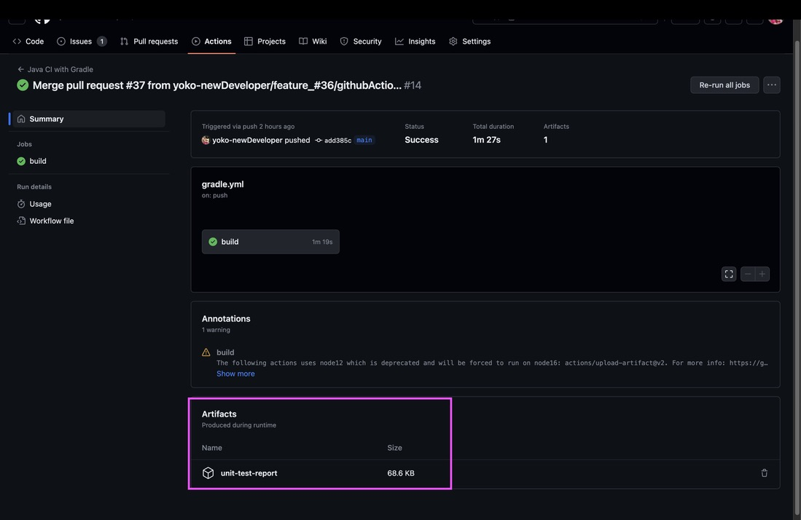
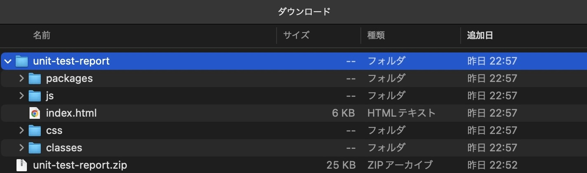

# GitHub Actionsとは

ワークフローを自動化する

自動でビルド->テスト->デプロイまで管理できる様になる仕組み

- CI（継続的インテグレーション）：ビルド＆テスト
- CD（継続的デリバリー）：デプロイ

## ワークフロー構文

- `name`: (省略可能)ワークフロー名。GitリポジトリのActionsタブに表示される
- `on`:アクションのトリガー
    - `push`や`pull_request`でトリガーのタイミングを指定可能
    - `pull_request`:デフォルトで`types: [ opened, synchronize, reopened ] 3つのイベントが実行される By default
        - `opened`: Pull Requestがopenされたときにワークフローが動き出す
        - `synchronize`: Pull Requestに対して何らかの変更(=push)があったときにワークフローが動き出す
        - `reopen`:Pull Requestが再度openされたにワークフローが動く
- `branches`:ブランチを指定可能
- `permissions`:アクション実行時のリポジトリコンテンツに対する権限
- `jobs`:ワークフローファイルで実行されるすべてのジョブをグループ化している
    - `build`:ジョブの名前。実行環境と手順を定義
    - `runs-on`:ジョブを実行するマシンの種類を設定(`ubuntu-latest`:最新のUbuntu環境)
    - `steps`:具体的なタスク(手順)
    - `uses`:ジョブで指定するリポジトリ
- `run`:具体的なシェルで`|`を使えばパイプライン処理も可能
- `run-name:`pushやpull_requestイベントによってトリガーされるワークフローの場合、コミットメッセージとして設定される

## タスク順序

- Hello Worldするだけのワークフローを作成
- pull Requestをトリガーとして動くようにワークフローを修正
- Gradleでtestする方法を調べる
- GitHub ActionsでGradleをzipに固めてアップロードする方法を検索
- /gradle testの実行結果のテストレポートをUploadするようにワークフローを修正

## gradleでtestする方法

- GradleでJavaのプロジェクトのビルドとテストを行う
- docker compose upする手順をワークフロー内に組み入れること

## 動作確認

- `./gradlew test`:Gradleを使ってプロジェクトをビルドし、ユニットテストを実行する
- `./gradlew clean test`:プロジェクトをクリーンにしてからテストする

---

- uses:actions/upload-artifact@v2:upload-artifactを使用してアップロードを行う
- アップロード先:GitHubのストレージ

## artifact確認方法

- `Actions`一覧より左のサイドバーから該当のワークフローを選択->`workflow runs`から実行の名前を選択
  

- `Artifacts`:成果物が生成される
  
- zipを確認
  
